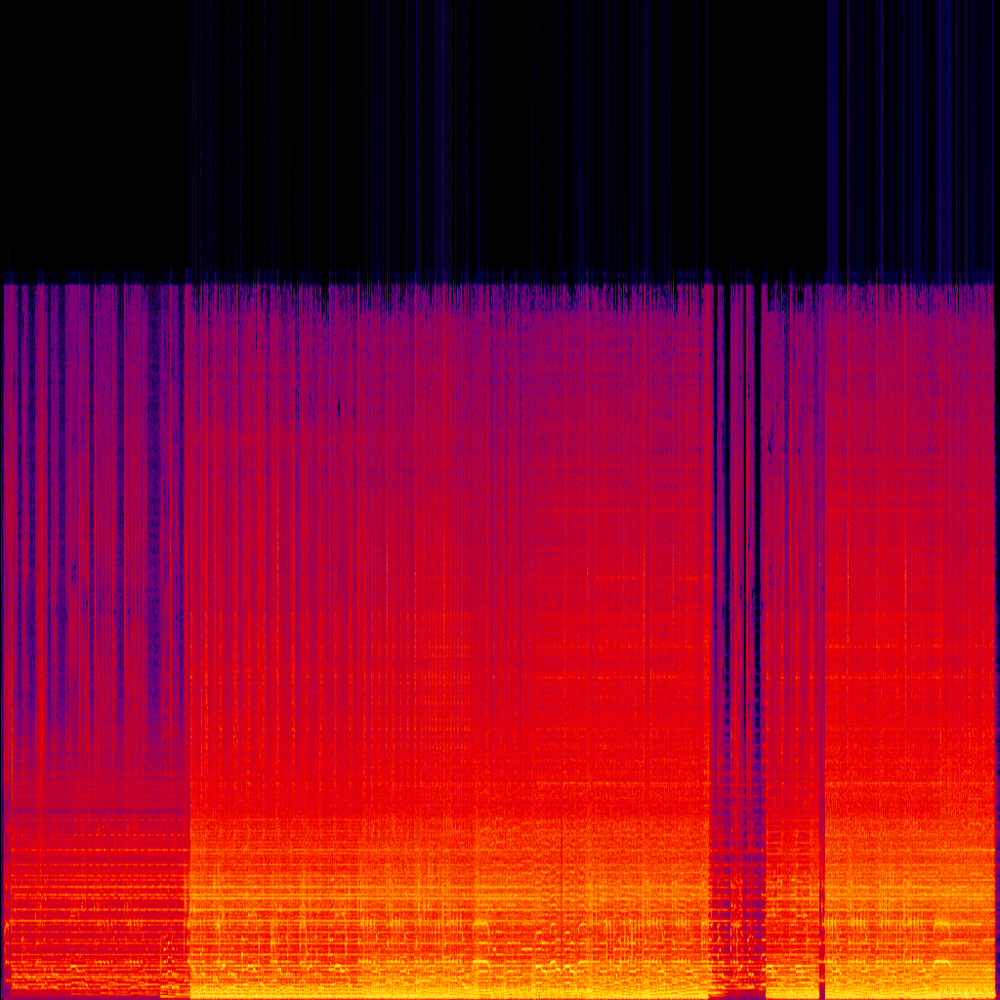

# 🎨 Album Art Generator Using AI

## 📌 Project Description
This project aims to generate **custom album covers** by analyzing **song audio features, lyrics, and genre**. By extracting relevant information and applying **deep learning techniques**, the system creates an artistic representation of a song using **Stable Diffusion**. The project integrates **Spotify API for metadata retrieval**, **Genius API for lyrics extraction**, and **Librosa for audio feature analysis**.

## 🎯 Key Features
- **Multimodal Input:** Uses **audio signals, song lyrics, and genre** to generate descriptive prompts.
- **Stable Diffusion AI:** Converts descriptive prompts into **unique album covers**.
- **Audio Feature Extraction:** Extracts **MFCC, chroma, spectral contrast, and tonnetz** features.
- **Text Analysis:** Uses **sentiment analysis on lyrics** to determine the song's emotional tone.
- **Spotify & Genius API Integration:** Fetches song metadata, genre, and lyrics dynamically.

## 📂 Project Workflow
The following flowchart illustrates the overall workflow of the system:
📌 *Workflow Representation:* 

1️⃣ **User uploads a song file** (or enters song metadata).  
2️⃣ **Audio features are extracted** using `librosa`.  
3️⃣ **Lyrics are fetched and analyzed** using Genius API & sentiment analysis.  
4️⃣ **Genre & album metadata are retrieved** using Spotify API.  
5️⃣ **All extracted information is converted into a textual prompt**.  
6️⃣ **Stable Diffusion generates an AI-driven album cover**.  

---

## 🏗️ Model Architecture

### 🎵 **Audio Processing Pipeline**
- **Feature Extraction:** MFCC, Chroma, Spectral Contrast, Tonnetz.
- **Statistical Analysis:** Mean and standard deviation calculations for feature ranking.
- **Interpretation:** Audio features are translated into descriptive text (e.g., "rich harmony").

📌 *Example Spectrogram Visualization:* 

### 📝 **Text Processing Pipeline**
- **Lyrics Sentiment Analysis:** Determines song mood (e.g., uplifting, melancholic).
- **Keyword Extraction:** Identifies dominant words influencing the album cover theme.

### 🖼️ **Image Generation Pipeline**
- **Prompt Engineering:** Combines extracted features into a structured prompt.
- **Stable Diffusion Model:** Transforms textual descriptions into **high-quality album art**.

📌 *Stable Diffusion Model Overview:* 

## ⚙️ Installation & Setup

### 1️⃣ Clone the Repository
```sh
git clone https://github.com/ozy-7/album-art-generator.git
cd album-art-generator
```

### 2️⃣ Install Dependencies
```sh
pip install -r requirements.txt
```

### 3️⃣ Set API Credentials
Create a `.env` file and add your **Spotify, Genius, and Hugging Face API keys**:
```sh
SPOTIFY_CLIENT_ID=your_spotify_client_id
SPOTIFY_CLIENT_SECRET=your_spotify_client_secret
GENIUS_API_KEY=your_genius_api_key
HUGGINGFACE_TOKEN=your_huggingface_token
```

### 4️⃣ Run the Application
```sh
streamlit run album_art_generator.py
```

## 📊 Results & Evaluation
The system successfully generates **realistic, AI-driven album covers** by fusing **audio, lyrics, and metadata**. Below is an example comparison between **generated album art vs. original album cover**:

📌 *Generated vs. Real Album Cover:* 

## 🔮 Future Improvements
- **Enhanced Prompt Engineering**: More advanced text-to-image descriptions.
- **Higher-Resolution Images**: Fine-tune the model for HD album covers.
- **Style Customization**: Allow users to define artistic styles (e.g., surreal, cyberpunk).
- **Real-Time Processing**: Optimize for live music input and immediate cover generation.

---
🚀 This project combines **music intelligence with AI creativity** to create album art like never before.
